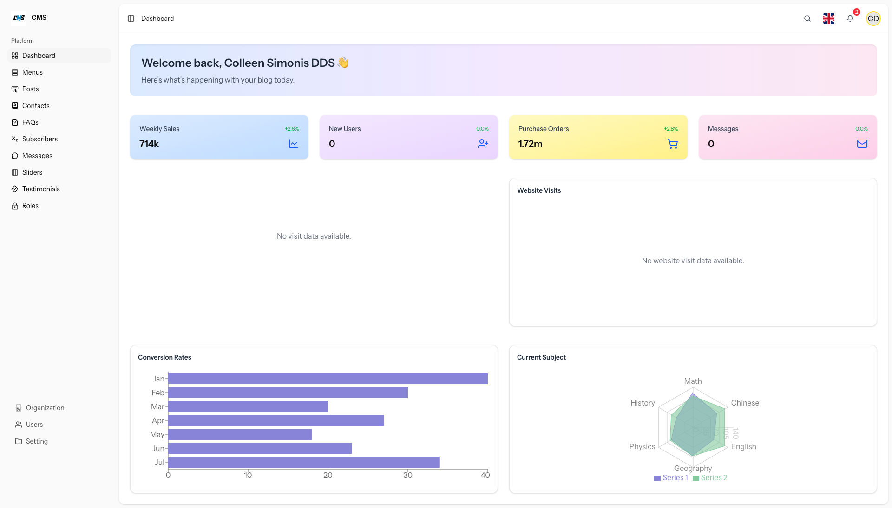

# Laravel CMS for Small Website

A lightweight Content Management System (CMS) built using Laravel for managing small website content easily from a user-friendly admin dashboard.

## 🚀 Features

- ✏️ Page & Post Management (WYSIWYG editor)
- 🖼 Media Library (Image/File Uploads)
- 👤 User Authentication and Roles (Admin, Editor)
- 🗂 Menu Builder for Website Navigation
- ⚙️ General Site Settings
- 🔍 SEO Tools (Meta Title, Description)
- 📦 Modular structure for easy customization

## 🛠 Installation

### Requirements

- PHP >= 8.1
- Composer
- Laravel >= 10
- MySQL or PostgreSQL
- Node.js & npm (for frontend assets)

### Steps

```bash
# Clone the repository
git clone https://github.com/your-username/laravel-cms.git
cd laravel-cms

# Install dependencies
composer install
npm install && npm run dev

# Set up environment
cp .env.example .env
php artisan key:generate

# Configure your DB settings in .env

# Run migrations and seed default data
php artisan migrate --seed

# Serve the app
php artisan serve
``` 


